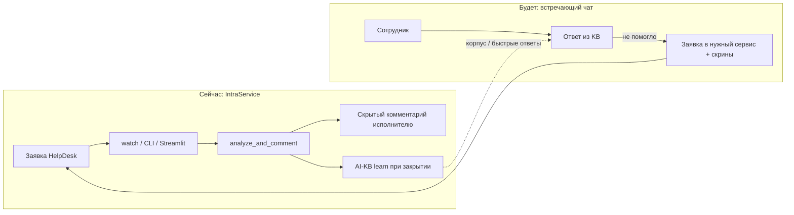

# Архитектура chatbot_intraservice

Карта «куда смотреть». Не дублирует README — только границы и потоки.

## Один продукт, два этапа

По деке «ИИ в поддержке 2026» мы на этапе **чатбот в IntraService**. Следующий видимый пользователю слой — **чат, встречающий сотрудников**.

| Слой | Кто пользователь | Код сегодня |
|------|------------------|-------------|
| **IntraService / L1 HD** | исполнитель 1 линии | `analyze_and_comment`, `watch_*`, `app.py` |
| **AI-KB** | оператор (ревью) | `kb_*` / `learn_*` — топливо и для встречающего чата |
| **Встречающий чат (L0)** | сотрудник IEK | **ещё нет** — `docs/specs/L0_employee_chatbot.md` |

`docs/prompts/` и сценарий «вопрос → заявка» — задел под встречающий чат; сейчас в проде крутится IntraService-контур.

## Поток L1 (фактический)

1. Триггер: `watch_new` / `watch_overdue` / `watch_user_reply` / UI / CLI / **n8n** (HTTP → `n8n_http_server`).
2. Вложения → `attachments.py` (VL + текст PDF/DOC).
3. Контур → `assistants.choose_*` + corpus `knowledge/{lk,bp,1c,crm}/`.
4. LLM → `llm.iek.local` (`confluence-agent` → fallback `gpt-oss`); сборка промпта из `knowledge/prompts/` + `docs/правила/` (`prompt_store`).
5. Скрытый комментарий (+ опционально public при KB / просрочке).
6. Закрытие + gap → `kb_learning` → черновик → Streamlit Promote → Confluence «Быстрые ответы» → `build_*_corpus`.

Редактирование промптов/корпусов: Streamlit вкладка **«Промпты и корпуса»**.

Артефакты прогона: `pipeline/runs/{run_id}/`.

## Границы модулей

| Граница | Не смешивать |
|---------|----------------|
| HelpDesk API | только `intraservice.py` |
| Confluence write | `confluence_client.py` + publish scripts |
| Настройки | `settings.py` ← default + local + env |
| Обучение KB | не писать в corpus напрямую из analyze — только через learn + Promote |
| OWUI `*-web-helper` | ручной чат; HD-бот их **не** вызывает как `model` |

## Конфиги и внешние системы

| Система | Назначение |
|---------|------------|
| `helpdesk.iek.local` | заявки, файлы, lifetime |
| `llm.iek.local` | chat completions |
| `confluence.dev.iek.ru` | WEBKB, AI-KB, быстрые ответы |
| `adm.bp` / `lk-admin` | проверки учёток |
| `chatgpt.iek.local` | OWUI (ручной чат / Knowledge refresh) |

PageId и карта: `docs/confluence/kb_assistant_pages.json`.

## Где не искать «магию»

- MCP-тулы Confluence из скрина OWUI **не** подключены к пайплайну HD.
- Поиск при learn: REST CQL + локальный corpus + `confluence-agent` RAG.
- Одноразовые `_*.json` / `_probe_*` в корне пакета — отладка, не API.
