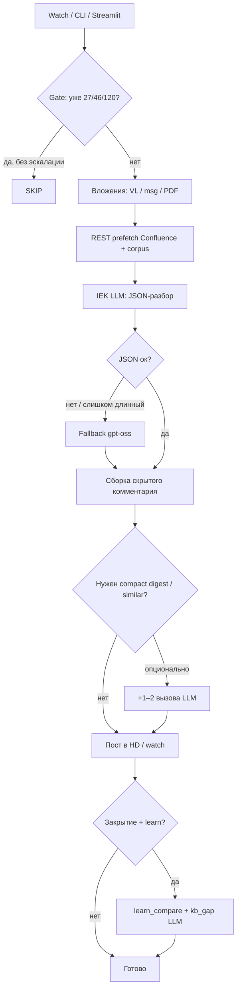

# IEK LLM: LiteLLM API vs Open WebUI MCP (Confluence)

## Почему в UI есть `confluence_search`, а в боте — нет (нативного MCP)

Чатбот IntraService ходит в **LiteLLM**:

```
POST https://llm.iek.local/v1/chat/completions
Authorization: Bearer IEK_LLM_TOKEN
{ "model": "iek/gpt-oss-120b", "messages": [...] }
```

Карточка [support-dep-lk-web-helper](https://chatgpt.iek.local/?model=support-dep-lk-web-helper) в **Open WebUI** — другой контур:

- id модели (`support-dep-lk-web-helper`) **нельзя** передать как `model` в LiteLLM;
- MCP-инструменты (`confluence_search`, `confluence_get_page`, …) подключаются к **сессии OWUI**, не к произвольному HTTP-клиенту.

Проверка платформы: `python scripts/probe_iek_llm_tools.py` → `_probe_llm_tools.json`.

**Результаты зонда (2026-08-31, актуализация 2026-09):**

| Проверка | Результат |
|----------|-----------|
| LiteLLM `iek/confluence-agent` + `tools` | **снят с прокси** (2026-09): HTTP 400 Invalid model — не использовать |
| LiteLLM `iek/gpt-oss-120b` + `tools` | HTTP 200, tool_calls возможны — но прокси **не исполняет** tool; нужен agent loop в клиенте |
| OWUI `support-dep-lk-web-helper` | MCP: `server:mcp:iek-confluence-help-mcp`, `server:mcp:IEK-confluence-web` |
| OWUI `/api/chat/completions` | HTTP 200 (отдельный API, `IEK_LLM_API_KEY`) |
| REST prefetch бота | CQL search в WEBKB — работает (`confluence_tools.py`) |

---

## Flowchart: как бот обрабатывает заявку



**Где вызывается IEK LLM** (типичный `watch_new` / `analyze_and_comment`):

| # | Вызов | Когда | Модель |
|---|-------|-------|--------|
| 0–N | Вложения (скрин VL / смысл .msg/.pdf) | есть файлы | VL / text LLM |
| 1 | Основной JSON-разбор | всегда | `IEK_LLM_SUPPORT_MODEL` → resolve → `gpt-oss-120b` |
| 2 | Fallback разбора | 400 / пусто / «слишком длинный» / битый JSON | fallback |
| 3 | `rank_similar_by_llm` | есть кандидаты похожих и основной JSON не выбрал | fallback |
| 4 | `compose_compact_digest` | почти всегда после разбора | fallback |
| 5–6 | Learn (`learn_compare`, `kb_gap_llm`) | только при learn / закрытии | learn model |

Prefetch Confluence — **не** LLM (REST CQL + PAT).

---

## Можно ли уменьшить число запросов к IEK LLM?

**Да.** Сейчас на одну заявку часто уходит **2–4+** вызова (разбор + compact + similar + вложения). Имеет смысл:

| Идея | Эффект | Риск / как |
|------|--------|------------|
| **Объединить разбор + compact** в один JSON (narrative + facts + reply) | −1 вызов почти всегда | Чуть длиннее промпт; убрать отдельный `compose_compact_digest` |
| **Не звать `rank_similar_by_llm`**, если кандидатов ≤1 или score уже высокий эвристикой | −0…1 | Чуть больше ложных «похожих» по слову |
| **OCR/VL только при картинках**; .msg без LLM, если текст короткий | −1 на письмо | Реже «смысл вложений» |
| **Не делать fallback**, если основной ответ уже валидный JSON | −0…1 | Уже почти так; не слать мёртвые модели (`resolve_model`) |
| **Learn только на закрытии**, не на analyze | −2 на открытой заявке | Уже: `auto_learn_on_analyze=false` |
| **Кэш prefetch / корпуса** по fingerprint темы | меньше Confluence, не LLM | — |
| Agent loop + tools | может **увеличить** число раундов | Пока не включать |

**Практичный минимум на пилот:** 1 LLM на разбор (с narrative в том же JSON) + VL только для скринов + learn только на close = обычно **1–2** запроса вместо 3–4.

Статус на 2026-09: мёртвый `confluence-agent` больше не шлётся (`llm_client.resolve_model`); остаётся оптимизация compact/similar — backlog.

---

## Что реализовано в боте (рекомендуемый способ)

**REST prefetch** — аналог MCP до вызова LLM (`src/confluence_tools.py`):

| Шаг | Аналог OWUI | Реализация |
|-----|-------------|------------|
| Поиск | `confluence_search` | `confluence_client.search_pages` (CQL `text ~` в WEBKB) |
| Страница | `confluence_get_page` | `confluence_client.get_page` + plain excerpt |
| Prefetch заявки | — | `prefetch_for_ticket()` → блок в system prompt |
| Артефакт | — | `_analysis_{id}.json` → `confluence_prefetch` |

Включено по умолчанию: `confluence_prefetch_enabled: true` в `config/settings.default.json`.

Порядок в разборе заявки:

1. Локальный корпус ЛК/БП/1С (`assistants.load_corpus`).
2. **Confluence prefetch** (REST) — топ hits + фрагмент лучшей страницы.
3. IEK LLM `iek/gpt-oss-120b` (после снятия `confluence-agent`; имя из `/v1/models` через `resolve_model`).
4. Fallback JSON: тот же / другой fallback при сбое парсинга.

Learn-пайплайн: тот же CQL через `_confluence_excerpt_for_learning` в `kb_learning.py`.

---

## Что ещё работает без MCP

| Механизм | Где |
|----------|-----|
| Локальный корпус | `assistants.load_corpus()` |
| REST Confluence (черновики, CQL, prefetch) | `src/confluence_client.py` + PAT |
| OCR/вложения | `attachments.py` + VL-модель |
| ~~RAG Confluence на стороне LLM~~ | ~~`iek/confluence-agent`~~ — **снят** с LiteLLM (2026-09) |

---

## Варианты улучшения

### A. Текущий (в проде): LiteLLM + REST prefetch + corpus

**Плюсы:** один токен `IEK_LLM_TOKEN`, логи в `_analysis_*.json`, не зависит от OWUI session.  
**Минусы:** нет интерактивного tool-calling (модель не «сама» решает, когда искать повторно).

### B. Open WebUI Chat API с `*-web-helper`

`POST https://chatgpt.iek.local/api/chat/completions` + `IEK_LLM_API_KEY` — если платформа отдаёт tools на этом endpoint (проверяет `probe_iek_llm_tools.py`).

**Статус:** не основной путь HD-бота; карточки создаются `create_owui_bp_1c_models.py` (`builtin_tools: true` — флаг UI, не LiteLLM).

### C. Экспорт MCP на LiteLLM proxy (запрос к платформе IEK LLM)

Целевой формат:

```json
POST /v1/chat/completions
{
  "model": "iek/gpt-oss-120b",
  "messages": [...],
  "tools": [{"type": "function", "function": {"name": "confluence_search", ...}}],
  "tool_choice": "auto"
}
```

Если `probe_iek_llm_tools` → `has_tool_calls: false` — на прокси tools пока нет; prefetch остаётся обязательным.

### D. Полный agent loop в боте

Несколько раундов: LLM → tool_call → REST → tool_result → LLM. Имеет смысл после появления стабильного `tools` на LiteLLM. **Внимание:** это может увеличить число запросов — сначала сжать текущий пайплайн (§ выше).

---

## Практическая рекомендация

1. **Разбор заявок:** LiteLLM + `gpt-oss-120b` (или новый агент ДИТ, когда появится в `/v1/models`) + **REST prefetch** + corpus.
2. **Ручная проверка с MCP:** OWUI `support-dep-lk-web-helper`.
3. **Отладка:** `_analysis_{task_id}.json` → `llm_request`, `confluence_prefetch`, `llm_meta` · [отладка_llm.md](../pipeline/отладка_llm.md).
4. **Меньше шума на шлюзе:** не слать снятые модели; опционально объединить compact в основной JSON.

---

## Переменные окружения

```env
IEK_LLM_TOKEN=...              # LiteLLM — бот
IEK_LLM_API_KEY=...            # Open WebUI — карточки / probe
IEK_LLM_SUPPORT_MODEL=iek/gpt-oss-120b
IEK_LLM_SUPPORT_FALLBACK_MODEL=iek/gpt-oss-120b
IEK_LLM_LEARN_MODEL=iek/gpt-oss-120b
CONFLUENCE_BASE_URL=...
CONFLUENCE_PAT=...
```

---

## Файлы в репозитории

| Файл | Назначение |
|------|------------|
| `src/confluence_tools.py` | REST-аналог MCP search/get_page + prefetch |
| `src/llm_client.py` (корень репо) | `resolve_model` — не слать снятые id |
| `scripts/probe_iek_llm_tools.py` | зонд LiteLLM tools и OWUI model meta |
| `scripts/publish_iek_llm_mcp_confluence.py` | синхронизация этой страницы в WEBKB |

Обновление Confluence: `python scripts/publish_iek_llm_mcp_confluence.py`
