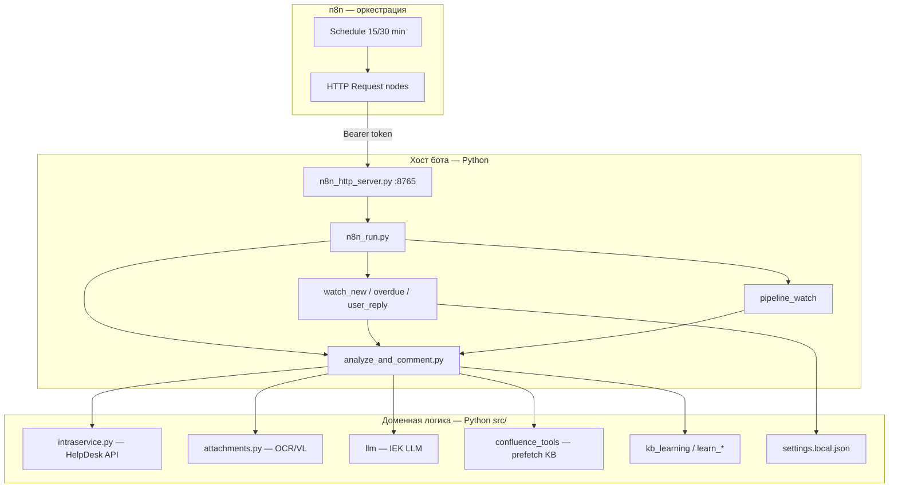

# Переход на n8n: оркестрация vs логика бота

Документ для операторов и разработчиков: что изменилось при замене Windows Task Scheduler на **n8n.iek.local**, и **стоит ли** переносить вызов LLM / запись в IntraService из Python в n8n.

## Краткий ответ

| Вопрос | Ответ |
|--------|--------|
| Зачем n8n? | Расписание, мониторинг запусков, единая точка автоматизации рядом с LK webhook |
| Что делает n8n сейчас? | По cron вызывает HTTP API бота: `POST /run/watch-new` и др. |
| Где вся логика? | В Python: `watch_*.py`, `analyze_and_comment.py`, `src/*` |
| Переносить LLM и IntraService API в n8n? | **Нет** для прода — только оркестрация в n8n, доменная логика в Python |

---

## Было → стало

### Было (Task Scheduler)

```
Windows Task Scheduler (каждые 15–30 мин)
  → python scripts/watch_new.py
  → python scripts/watch_overdue.py
  → …
```

Минусы: логи разрозненны, нет UI истории запусков, привязка к одной Windows-машине, сложно дать доступ коллегам без RDP.

### Стало (n8n + HTTP API)

```
n8n.iek.local — workflow «IntraService HelpDesk Bot»
  → POST http://<хост-бота>:8765/run/watch-new     (каждые 15 мин)
  → POST …/run/watch-overdue
  → POST …/run/watch-user-reply
  → POST …/run/pipeline-watch                     (каждые 30 мин)
       Authorization: Bearer <N8N_API_KEY>

На хосте бота:
  n8n_http_server.py  →  n8n_run.py  →  watch_*.py / analyze_and_comment.py
```

Плюсы: история executions в n8n, алерты, тот же n8n что для LK Assistant, можно вручную перезапустить ветку из UI.

**Важно:** n8n **не заменяет** код бота — он только **будит** уже существующие скрипты.

---

## Схема слоёв



---

## Что происходит внутри одного цикла (на примере watch-new)

1. **n8n** шлёт один HTTP POST (без знания о заявках).
2. **`watch_new.py`** — опрос IntraService API, фильтр статусов 31/38/121, контуры lk/bp, антидубль.
3. Для каждой кандидатной заявки — **`analyze_and_comment.py`**:
   - скачать вложения, VL/OCR;
   - prior/similar заявки, lk-admin, adm.bp, 1С;
   - prefetch Confluence (REST);
   - **вызов IEK LLM** (`confluence-agent` → fallback `gpt-oss`);
   - формат скрытого комментария;
   - **POST комментария** в IntraService (если `auto_post_comment`);
   - артефакт `_analysis_*.json` / `pipeline/runs/`.
4. JSON-ответ возвращается в n8n (сколько проверено, сколько обработано).

Весь путь — **сотни строк ветвлений**, настройки из `settings.local.json`, секреты из `.env`. Это не «три ноды в n8n».

---

## Можно ли перенести LLM и IntraService в n8n?

### Технически — да

Теоретический workflow n8n:

1. HTTP → IntraService `GET /api/task` (список заявок)
2. Split In Batches → для каждой заявки
3. HTTP → скачать файлы
4. HTTP → `llm.iek.local/v1/chat/completions`
5. Code node → собрать текст комментария
6. HTTP → IntraService `POST` комментарий

### Практически — **не стоит** (для этого продукта)

| Критерий | Python (сейчас) | Полный n8n |
|----------|---------------|------------|
| Вложения (PDF, .msg, скрины, VL) | `attachments.py`, тесты, отладка | Громоздко: binary, base64, лимиты нод |
| Fallback LLM, prefetch Confluence | В коде, версионируется в git | Дублирование в Code nodes |
| Контуры lk/bp, service_filter | `service_filter.py`, unit-логика | Копипаста в n8n |
| KB learning, черновики, Promote | Отдельный контур `learn_*` | Отдельные workflows × сложность |
| Артефакты отладки (`llm_request`, Streamlit) | Уже есть | Придётся строить заново |
| Ревью кода, CI, AGENTS.md | Привычный пайплайн | JSON workflow сложнее ревьюить |
| Секреты | `.env` локально | Все ключи в n8n credentials + дубли |

**Риск:** два источника правды — логика в n8n и остаток в Python; расхождение формата комментария, пропуск контуров, поломка при смене модели LLM.

### Рекомендуемая граница

| Слой | Где |
|------|-----|
| Cron, retry, алерт в Teams/почту | **n8n** |
| Ручной webhook «разобрать заявку #id» | **n8n** → `POST /analyze/{id}` |
| Опрос HD, LLM, комментарий, learn | **Python** |
| Настройки L1 (`auto_post_comment`, контуры) | **settings.local.json** / Streamlit |

Это паттерн **«тонкий оркестратор + толстый доменный сервис»** — как у вас уже с LK webhook (n8n принимает запрос, тяжёлую работу делает приложение).

---

## Когда имеет смысл расширять n8n

Разумные следующие шаги **без** переноса LLM:

1. **Алерт при ошибке** — если HTTP 500 или `ok: false` в ответе → уведомление в Teams.
2. **Ручной запуск** — webhook «разобрать #699465» → `POST /analyze/699465` с `{"post": true}`.
3. **Параллель по контурам** — два schedule: lk и bp (если понадобится разная частота).
4. **Healthcheck** — n8n пингует `GET /health` раз в час.

Неразумно на текущем этапе: переписать `analyze_and_comment.py` цепочкой из 20 HTTP-нод.

---

## Операционный чеклист перехода

### 1. Ключи

- `N8N_API_KEY`, `N8N_BASE_URL` — в **корневом** `.env` монорепо.
- Пакет подхватывает через `env_bootstrap` (корень → `chatbot_intraservice/.env`).

### 2. HTTP API на хосте бота

```powershell
cd chatbot_intraservice
python scripts/n8n_http_server.py
# GET http://<ip>:8765/health  →  ok: true
```

`N8N_BOT_CALLBACK_URL=http://<ip>:8765` — IP, видимый **с сервера n8n** (не localhost).

### 3. Workflow

```powershell
python scripts/n8n_setup_helpdesk_watch.py --bot-url http://<ip>:8765
```

Workflow: **IntraService HelpDesk Bot** на https://n8n.iek.local

### 4. Проверка

- Executions в n8n — зелёные POST.
- В HelpDesk — новые скрытые комментарии по расписанию.

### 5. Отключить Task Scheduler (после 1–2 дней)

```powershell
Disable-ScheduledTask -TaskName "IEK-IntraService-WatchNew"
Disable-ScheduledTask -TaskName "IEK-IntraService-WatchOverdue"
Disable-ScheduledTask -TaskName "IEK-IntraService-WatchUserReply"
Disable-ScheduledTask -TaskName "IEK-IntraService-WatchLearn"
```

`n8n_http_server.py` должен стартовать при входе в систему (отдельная задача планировщика или служба).

### 6. Диагностика

```powershell
python scripts/n8n_probe.py
python scripts/n8n_run.py watch_new --dry-run
```

---

## Endpoints HTTP API (для n8n)

| Метод | Путь | Назначение |
|-------|------|------------|
| GET | `/health` | Без авторизации |
| POST | `/run/watch-new` | Новые/переданные заявки |
| POST | `/run/watch-overdue` | «До просрочки» |
| POST | `/run/watch-user-reply` | Ответ заявителя |
| POST | `/run/pipeline-watch` | Закрытые → learn |
| POST | `/analyze/{task_id}` | Одна заявка; body `{"post": true, "learn": false}` |

Авторизация (кроме `/health`): `Authorization: Bearer <N8N_API_KEY>`.

---

## Связанные материалы

- Локально: `docs/интеграции/n8n.md`
- Архитектура: `docs/ARCHITECTURE.md`
- IntraService API: `docs/интеграции/intraservice_api.md`
- IEK LLM: страница «IEK LLM и Confluence (MCP vs REST)» в WEBKB
- Свод проекта: «Чатбот IntraService: пайплайн, AI-KB и настройки»

---

## Итог для руководства

**Переход на n8n — это смена планировщика и улучшение наблюдаемости**, не смена платформы разработки бота. LLM, разбор заявки и запись в HelpDesk остаются в Python, потому что там сосредоточены знания предметной области, тесты и артефакты качества. n8n вызывает бота как **чёрный ящик** по HTTP — так же, как внешний оператор жмёт «Разобрать» в Streamlit.
