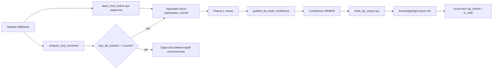

# Наполнение KB ассистента IntraService (AI-KB)

Цель: если заявка **решена**, а при разборе **не было готового ответа в WEBKB** — зафиксировать решение исполнителя, дополнить базу, переобучить корпус чатбота.

## Архитектура



## Ветка Confluence (WEBKB)

| Уровень | pageId | Назначение |
|:--|:--|:--|
| Техподдержка WEB | 76026317 | Родитель |
| Чатбот 1 линии | **124630073** | Схема, процесс |
| **AI-KB (создать)** | — | «Чатбот IntraService: база быстрых ответов (AI-KB)» — индекс выученных блоков |
| БП быстрые ответы | **124629661** | Append блоков BP-XX (основной sink для bp) |
| Шаблоны ЛК / API БП | **124629493** | Доп. шаблоны |

Конфиг путей: `docs/confluence/kb_assistant_pages.json`.

## Где видно обучение и накопление знаний

| Место | Что видно |
|:--|:--|
| Streamlit → вкладка **AI-KB черновики** | список draft на ревью |
| `knowledge/learned/index.json` | task → код → status (draft/published) |
| `docs/черновики_статей/` | markdown до Confluence |
| `pipeline/digests/drafts_review_*.md` | еженедельный список «нужно ревью» |
| `pipeline/digests/gap_*.md` | закрытые с gap без черновика |
| Streamlit → История → AI-KB | попытки learn |
| Скрытый комментарий в заявке | строка `AI-KB: … создан черновик …` + ссылка |
| `knowledge/*/corpus.md` | то, что реально подмешивается в разбор HD |

**Сейчас обучение работает?** Да, при `auto_learn_kb=true` (local): после закрытия заявки с gap → черновик + заметка в заявке.  
В Confluence / корпус статья попадает **только после ревью** (`sync_kb_after_review.py`).

## Весь Confluence или только «быстрые ответы»?

| Канал | Охват |
|:--|:--|
| `iek/confluence-agent` | RAG по индексу ДИТ (WEBKB и связанные пространства) — **шире**, чем локальный corpus |
| `knowledge/bp|lk|1c/corpus.md` | Кураторский срез: быстрые ответы + выученные кейсы (надёжно в промпте) |
| OWUI Knowledge | Файлы, которые вы загрузили / refresh |

Весь Confluence в промпт **нельзя** (лимит токенов). Расширить знания можно так:

1. **Опереться на agent** — уже ходит в Confluence; если статья есть в WEBKB, но agent «не находит» — писать ДИТ (индекс/пространства).
2. **Добавить pageId в сборку корпуса** — `scripts/build_bp_corpus.py` → список `BP_PAGES` (и аналогично для ЛК).
3. **Опубликовать AI-KB** после ревью → страница попадает и в WEBKB, и в corpus после rebuild.
4. **OWUI** — привязать Confluence/Knowledge в карточке UI (для ручного чата; HD по-прежнему через agent + corpus).

Конфиг целей публикации: `docs/confluence/kb_assistant_pages.json`.

## Когда создавать черновик

| Условие | Действие |
|:--|:--|
| `has_kb_solution=false` или нет `article_links` | eligible для learn |
| **auto_learn_kb выключен** | не создавать (default) |
| **Чатбот нашёл KB** + `skip_if_kb_found` | **пропуск** |
| **Черновик уже в index** + `skip_if_draft_exists` | **пропуск** |
| Заявка закрыта + gap | `pipeline_watch.py` (если auto on) |
| Новый сценарий при общей статье | `--force` / UI |

**Настройки:** `streamlit run app.py` или `config/settings.local.json`. См. `docs/pipeline/решения.md`.

## Команды

```bash
# UI + настройки автозапуска
streamlit run app.py

# Полный прогон (артефакты в pipeline/runs/)
python scripts/run_ticket_pipeline.py 696955

# Разбор + скрытый комментарий + черновик если gap
python scripts/analyze_and_comment.py 696955 --post --learn

# Cron: закрытые заявки (нужен auto_learn_kb=1 в настройках)
python scripts/pipeline_watch.py
```

## Формат черновика

Автогенерация (`kb_learning` + `kb_gap_llm` + `learn_compare`). Схема: [`docs/pipeline/самообучение.md`](../pipeline/самообучение.md).

1. **Решение IEK LLM (ревью)** — источник HD#, вердикт, целевая статья (title · URL · pageId из контура), почему, **слова для дополнения** в `<!-- KB_INSERT_START/END -->`
2. **Контекст заявки** — факты без email / CreatorEmail / ServiceId
3. Опционально **Урок** (бот vs исполнитель)

**Lifecycle:** match на `in_review` → правка того же .md + Confluence review; после Promote → только новый review. Promote вставляет только KB_INSERT.

**Формат KB_INSERT:** [`формат_kb_insert.md`](формат_kb_insert.md) — лаконичный блок `## LK-NN` (IEK LLM `kb_article_compose`), не длинный контекст.

**После Promote:** правка в «Быстрых ответах»; страницу ревью в Confluence удалять (черновик остаётся локально).

## Связь с разбором заявки

Алгоритм исполнителя (`docs/правила/разбор_заявки_для_исполнителя.md`):

1. Контур lk/bp → ServiceId → adm → подсказка API
2. **KB в комментарий — только если есть в базе**
3. Если решили вручную и в KB не было — **флаг для learn** (или `--learn` сразу)

## Профили ассистента

| Профиль | Корпус | Откуда KB |
|:--|:--|:--|
| `bp_tickets` | `knowledge/bp/corpus.md` | Confluence 124629661, 124629493 + закрытые 833 |
| `l1_web` | — (Confluence-agent) | WEBKB через API модели; локальный LK-корпус — TODO |

После публикации в Confluence для **bp** обязателен `build_bp_corpus.py`.

## Что автоматизировать дальше

1. Webhook/cron при переводе в «Выполнена» → `learn_from_ticket --require-closed`
2. Отдельная child-страница AI-KB под 124630073 (индекс всех BP-XX)
3. `build_lk_corpus.py` для l1_web
4. Дедуп: не создавать второй черновик с тем же кодом/категорией
