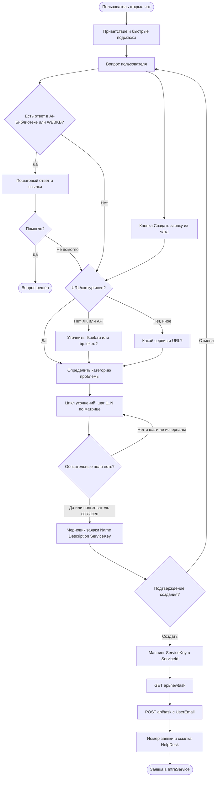

# BPMN / flowchart — чатбот L1 IEK

## Основной поток

## Длина цикла по сервису

| ServiceKey | Типичные категории | Шагов | Вопросов |
|:--|:--|:--:|:--:|
| kp | AUTH, ACCESS, SMS_2FA | 2 | 2–4 |
| lk | AUTH, ORDERS, API_LK, NS_RESERVE, DOCS_UPD | 2–3 | 2–5 |
| bp | AUTH_KEY, API_BP | 2–3 | 2–5 |
| vpn / mail / other | CONNECT, DISKS, DELIVERY… | 2 | 2–4 |

Детали вопросов: `prompts/матрица_уточнений.md`.
