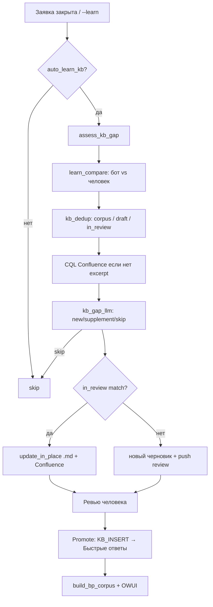

# Самообучение AI-KB (Corrective RAG) — идея и реализация

Документ описывает **как устроено** обучение чатбота IntraService из закрытых заявок HelpDesk: сравнение ответа бота и человека, поиск в Confluence, вердикт IEK LLM, черновик на ревью, Promote в «Быстрые ответы».

> Исходная идея — «Corrective RAG»: не писать непонятные статьи, а фиксировать **структурированный пробел** и **текст для вставки** с человеческим апрувом.  
> Публичная документация на Confluence: [Чатбот IntraService: пайплайн, AI-KB и настройки](https://confluence.dev.iek.ru/x/ONttBw) (§3.1) · дочерняя страница «Самообучение AI-KB (Corrective RAG)» (`scripts/publish_learning_confluence.py`).  
> Кратко для операторов: [`docs/pipeline/самообучение.md`](../docs/pipeline/самообучение.md).

---

## 1. Цель

| Шаг | Что делаем |
|-----|------------|
| 1 | Сравниваем **скрытый разбор чатбота** и **публичный ответ исполнителя** (IEK LLM). |
| 2 | Ищем **существующую статью** (локальный корпус, черновики, CQL Confluence WEBKB). |
| 3 | IEK LLM решает: `new` / `supplement` / `skip`, **почему неполно**, **слова для вставки** (без email). |
| 4 | Создаём **черновик на ревью** (Confluence `ai-kb-draft`) или **дописываем in_review** тот же файл. |
| 5 | Человек правит → **Promote** → только блок `KB_INSERT` в «Быстрые ответы» → `build_bp_corpus.py` → OWUI. |

**Не в scope (пока):** автоматические задачи Jira, SQLite-метрики, кластеризация паттернов по 5+ повторам (см. §6).

---

## 2. Реальная структура проекта

```
chatbot_intraservice/
├── app.py                          # Streamlit: AI-KB, Promote preview, Отклонить
├── config/
│   ├── settings.default.json       # auto_learn_kb, dedup, contour_enabled
│   └── settings.local.json
├── docs/
│   ├── confluence/kb_assistant_pages.json   # куда Promote (lk/bp/other)
│   ├── черновики_статей/*.md                # локальные черновики
│   ├── pipeline/решения.md                  # принятые правила AI-KB
│   └── правила/наполнение_kb_ассистента.md
├── knowledge/
│   ├── lk|bp|1c/corpus.md          # корпус для RAG при разборе
│   └── learned/
│       ├── index.json              # task_id → черновик → статус
│       ├── call_history.jsonl      # LLM / kb_learn события
│       └── learning_events.jsonl   # журнал самообучения (compare + gap)
├── pipeline/
│   ├── runs/                       # артефакты прогонов
│   ├── digests/                    # gap / drafts review
│   └── IDEA_RAG_LEARNING.md        # этот файл
├── scripts/
│   ├── analyze_and_comment.py      # разбор + опционально learn
│   ├── pipeline_watch.py           # закрытые → learn (watch)
│   ├── learn_from_ticket.py        # ручной learn по task_id
│   ├── push_kb_draft_confluence_review.py
│   ├── publish_kb_draft_confluence.py   # Promote → append KB_INSERT
│   ├── sync_kb_after_review.py
│   ├── weekly_gap_digest.py        # закрытые без черновика
│   └── publish_project_confluence.py
└── src/
    ├── learn_compare.py            # бот vs исполнитель (IEK LLM)
    ├── kb_gap_llm.py               # заявка vs статья → вердикт + KB_INSERT
    ├── kb_learning.py              # оркестрация learn_from_task_data
    ├── kb_dedup.py                 # Jaccard: new / supplement / duplicate
    ├── kb_promote_preview.py       # превью «куда вставится»
    ├── learn_journal.py            # learning_events.jsonl
    ├── confluence_client.py        # CQL search, create/update page
    ├── semantic_enrich.py          # prior, similar, compose digest
    └── intraservice.py             # HelpDesk API
```

Соответствие **устаревшим именам из черновика идеи**:

| Было в идее | Сейчас в репо |
|-------------|----------------|
| `src/rag/evaluator.py` | `src/learn_compare.py` + `src/kb_gap_llm.py` |
| `src/feedback/comparator.py` | `src/learn_compare.py` |
| `src/feedback/gap_analyzer.py` | `src/kb_gap_llm.py` + `src/kb_learning._run_gap_judgment` |
| `src/feedback/clusterizer.py` | **не реализовано** (см. §6) |
| `src/integration/confluence_mcp.py` | `src/confluence_client.py` (REST + CQL, не MCP) |
| `src/integration/jira_client.py` | **не реализовано** |
| `scripts/daily_retro.py` | `scripts/weekly_gap_digest.py` + ретро ЛК в отдельном репо |
| `config/confluence_mapping.json` | `docs/confluence/kb_assistant_pages.json` |
| `streamlit/dashboard.py` | `app.py` (вкладка AI-KB) |
| `metrics.db` | `knowledge/learned/*.jsonl` |

---

## 3. Пайплайн (пошагово)



### 3.1. Триггеры

| Триггер | Скрипт / место | Настройка |
|---------|----------------|-----------|
| Закрытие заявки | `pipeline_watch.py` | `auto_learn_kb` + `auto_learn_on_close` |
| Разбор с флагом | `analyze_and_comment.py --learn` | UI или CLI |
| Ручной | `learn_from_ticket.py <id>` | — |

По умолчанию **`auto_learn_kb: false`** — включить в Streamlit sidebar.

### 3.2. Corrective RAG — два слоя LLM

**A. `learn_compare`** — после закрытия, если в lifetime есть:
- скрытый комментарий «Разбор IEK LLM»;
- публичный ответ исполнителя.

JSON: `aligned`, `what_bot_missed_ru`, `what_bot_got_right_ru`, `kb_lesson_ru`, `suggested_public_reply_ru` → блок «Урок самообучения» в черновике.

**B. `kb_gap_llm.judge_kb_gap`** — сравнение заявки с фрагментом статьи:
- локальный matched draft / corpus (`kb_dedup`);
- при нехватке текста — **CQL** `confluence_client.search_pages` (WEBKB) + excerpt страницы.

JSON: `mode`, `incomplete`, `target_*`, `words_to_add`, `why_incomplete` → блок **«Решение IEK LLM (ревью)»** и маркеры:

```html
<!-- KB_INSERT_START -->
текст для «Быстрых ответов» без PII
<!-- KB_INSERT_END -->
```

### 3.3. Dedup и lifecycle черновиков

| Match | Действие |
|-------|----------|
| corpus / **published** | новый review `CODE-SUP-{task}` |
| **in_review** / draft | **update_in_place** (не плодить HD-09-SUP-SUP) |
| duplicate (score ≥ 0.55) | skip |
| после **Promote** | правки только через новый review |

`target_page_id` всегда из `kb_assistant_pages.json` по контуру (`lk`→124630014, `bp`→124629661), не из текста старого черновика.

### 3.4. Ревью и Promote

1. `push_kb_draft_confluence_review.py` → страница с меткой `ai-kb-draft`.
2. Человек правит в Confluence или локальном `.md`.
3. Streamlit: **Перед Promote** — превью (`kb_promote_preview.py`): куда, какой текст, предупреждения.
4. `sync_kb_after_review.py` → `publish_kb_draft_confluence.py` — append **только KB_INSERT**.
5. Review-страница: `ai-kb-published`, снимается `ai-kb-draft`.
6. **Отклонить** (`kb_learning.reject_draft`) → `[ОТКЛОНЕНО]`, `ai-kb-rejected`.

### 3.5. Журнал

`knowledge/learned/learning_events.jsonl` — каждый вызов `learn_from_task_data`: compare, gap, mode, target_page_id, draft_path.

---

## 4. Как запустить вручную

```powershell
cd chatbot_intraservice

# разбор + принудительное обучение
python scripts/analyze_and_comment.py 695751 --learn

# только learn (нужен _analysis_<id>.json)
python scripts/learn_from_ticket.py 695751

# watch закрытых (планировщик)
python scripts/pipeline_watch.py

# gap-дайджест (закрытые без черновика)
python scripts/weekly_gap_digest.py

# Promote после ревью
python scripts/sync_kb_after_review.py --task-id 697221

# обновить страницу проекта на Confluence
python scripts/publish_project_confluence.py

# полная схема Corrective RAG (дочерняя страница)
python scripts/publish_learning_confluence.py
```

---

## 5. Настройки (ключевые)

| Параметр | Смысл |
|----------|--------|
| `auto_learn_kb` | master switch |
| `auto_learn_on_close` | учить при закрытии |
| `skip_if_kb_found` | не учить, если разбор нашёл KB |
| `skip_if_draft_exists` | не дублировать по task_id |
| `semantic_supplement_threshold` | 0.22 → supplement |
| `semantic_duplicate_threshold` | 0.55 → duplicate |
| `auto_push_confluence_draft` | сразу страница ревью |
| `post_learn_note` | скрытая заметка в заявке со ссылкой на черновик |

Подробнее: `docs/pipeline/решения.md`.

---

## 6. План (ещё не сделано)

Из исходного промпта Corrective RAG **остаётся backlog**:

1. **Кластеризация ошибок** (`clusterizer`) — группировка `learning_events.jsonl` по теме; при N≥5 — задача на переработку статьи.
2. **Jira** — вместо/вместе с Confluence review создавать `WEB` issue с критериями приёмки.
3. **Расширенная оценка** — явные `groundedness` / `completeness` / `confidence_score` в JSON (сейчас — `aligned` + `incomplete` + `why_incomplete`).
4. **SQLite metrics.db** — агрегаты для дашборда (сейчас JSONL + Streamlit метрики в `call_history`).
5. **MCP Confluence** — опционально; сейчас достаточно `confluence_client.py` + `CONFLUENCE_PAT`.

---

## 7. Карта контуров → Confluence

Файл `docs/confluence/kb_assistant_pages.json`:

| Контур | pageId | Назначение |
|--------|--------|------------|
| `lk` | 124630014 | Быстрые ответы ЛК |
| `bp` | 124629661 | Быстрые ответы БП |
| `other` | (child под 124630073) | прочие HD-xx |
| review root | 124640307 | папка `ai-kb-draft` |

Корень схемы чатбота: **124630073**.

Документация Corrective RAG на Confluence: [124641312](https://confluence.dev.iek.ru/pages/viewpage.action?pageId=124641312) (child под 124640056).

---

## 8. Принципы качества (зафиксированы в коде)

1. **Нет PII** в `KB_INSERT` — `kb_gap_llm.sanitize_facts`, strip email.
2. **Понятный вердикт** в шапке черновика: источник HD#, целевая статья, почему, слова.
3. **Человек апрувит** текст вставки, не сырой dump lifetime.
4. **Promote ≠ весь черновик** — только `KB_INSERT` (fallback `full_md` с предупреждением в UI).
5. **in_review ≠ published** — дополнения к неопубликованному черновику правят его же.

---

*Обновлено: 2026-08-28. При изменении пайплайна синхронизировать этот файл и `scripts/publish_project_confluence.py`.*
